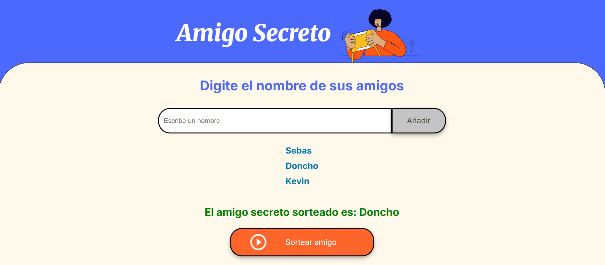

# 🎁 Amigo Secreto

Juego interactivo para sortear amigos secretos, desarrollado en **HTML, CSS y JavaScript** como parte del Challenge de Alura Latam.

La implementación visual de la página fue ofrecida por Alura Latam desde el HTML hasta el CSS, la parte lógica del amigo secreto fue implementada por este humilde servidor: Sebas Gómez.

Buscamos generar arrays para los amigos donde producimos funciones para la modularidad del código donde se utiliza Math.random para seleccionar una persona del juego al azar.



---

## 🚀 Cómo ejecutar el proyecto

1. Clona este repositorio:
   ```bash
   git clone https://github.com/TU_USUARIO/amigo-secreto.git


## Implementación de carpetas
.
├── index.html
├── style.css
├── app.js
├── README.md
└── assets/
    ├── preview.png
    ├── amigo-secreto.png
    └── icono.png

